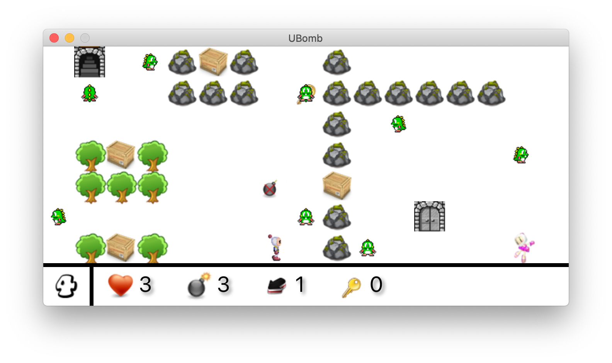

<link rel="stylesheet" href="readme.css">

# Projet de POO

2D video Game : **UBomb**.

Original Repo : https://github.com/reveillere/UBomb-student
Gitlab-Repo: https://gitlab.com/6pi/poo

## Principes du jeu

A princess is captured by horrible green monsters. Your mission if you accept it, is to rescue the princess. To achieve this mission you will have to 
go through multiple worlds, each one being more scarier than others. Doors let you travel from one world to another. Some doors are locked, those
doors requires you to have a key in your inventory. You are an expert in bombs, you can make use of your bombs to destroy obstacles in front of you and kill the monsters.

---

Une princesse est détenue prisonnière par de méchants monstres verts. Votre mission, si vous l'acceptez, est d'aller la délivrer. Pour cela, vous devrez traverser plusieurs mondes, plus effrayants les uns que les autres. Des portes vous permettront de passer de mondes en mondes. Certaines portes seront fermées à clés et nécessiteront d'avoir une clé dans votre inventaire. Vous êtes un expert en explosif et utiliserez vos bombes pour détruire les obstacles devant vous et tuer les monstres qui vous attaqueront.

## Représentation du jeu

Each world is represented by a rectangular map composed of cells. Each cells can contain:

-   the player ;
-   the princess ;
-   monsters ;
-   decor elements (tree, rocks...) none destructible
-   boxes fragile and movable; 
-   doors, closed or open, allowing to change world;
-   keys to open closed doors;
-   Bonus or curse collectable.

---

Chaque monde est représenté par une carte (rectangulaire) composée de cellules. Chaque cellule peut contenir :

-   le joueur ;
-   la princesse ;
-   des monstres ;
-   des éléments de décor (arbres, pierres...) infranchissables et
    indestructibles ;
-   des caisses destructibles et déplaçables ; 
-   des portes, ouvertes ou fermées, permettant d’évoluer entre les
    mondes ;
-   des clés pour débloquer les portes fermées ;
-   des bonus ou des malus qu'il est possible de ramasser.

## Prise en main

We give you a draft of the game, by using the library JavaFX. Running the game show a minimalistic map, load static in memory, in this map the player
can move in all directions no matter the cell.
The code use `gradle` for production. You can run the following command to run the game.
All the dependencies will be automatically downloaded and installed. A version of java 11 is required.

    $ ./gradlew run

---

Nous vous fournissons une première ébauche du jeu, utilisant la bibliothèque JavaFX. Le lancement du jeu
fait apparaître une carte minimaliste, chargée statiquement en mémoire, dans laquelle le joueur peut se déplacer dans toutes les directions quelle que soit la nature des cellules. Le code utilise `gradle` comme moteur de production. Il suffit de lancer la commande suivante pour compiler et exécuter le jeu. Toutes les dépendances seront automatiquement téléchargées et installées. Le jeu nécessite une version de Java au moins égale à 11.

    $ ./gradlew run

Work to produce / Travail à fournir
=================

## First step / Premiers pas 

Display all elements (boxes, bonuses, keys ...) monsters and princess. For now the monsters don't know how to walk, they don't move.
Modify the code to limit the player to move outside of the map and to walk over obstacles.
The player can walk on a cell with a bonus a key or another character. The player must loose a life when colliding with a monster.
If the player reaches the princess the game is won (and you reach the end of the game).
If the life are null, the game is over. 

--- 

Ajouter l'affichage de tous les éléments (caisses, bonus, clés...) ainsi que les monstres et la princesse. Pour le moment, les monstres ne savent pas marcher, ils ne bougent pas. Modifier le code pour que les mouvements du joueur soient limités par le cadre de la carte, les éléments de décor et les caisses. 
Le joueur peut marcher sur une case où se trouve un bonus, une clé, ou un autre personnage. Faire en sorte que le joueur perde une vie lorsqu'il se trouve sur la même case qu'un monstre.
S’il atteint la princesse, la partie se termine par une victoire.
Si ses points de vie tombent à 0, la partie se termine par une défaite.

## Information pannel / Gestion du panneau d’informations

The information pannel should display the number of lives, number of bombs, range of the bombs, number of keys owned by the player and the number of the actual world.

---

Le panneau d’information doit afficher le nombre de vies, le nombre de bombes et leur portée, le nombre de clés dans l’inventaire et le numéro de niveau courant.

## World management / Gestion des mondes

The directory `sample` contains the maps. The configuration of the game is given in the property file `config.properties`. We defined the following conventions:
- Maps are stored as text file to be able to create and modify them with a text editor;
- the file name of a map should be `<prefix>N.txt` where `N` is the number of the level and `<prefix>` is the value of `prefix` in the configuration file;
- the top left corner is `(0,0)`;
- each row is a row of cells on the map
- each cell of the map is defined by respecting the code defined in the file `WorldEntity.java`

Modify the code in package `game` to load the game from the file of the directory `world`.

---

Le dossier de ressources `sample` contient les cartes correspondant à trois niveaux. La configuration du jeux est fournie dans le fichier de propriété `config.properties`. Nous définissons les conventions suivantes :

-   les cartes sont stockées sous forme de fichiers texte afin de
    pouvoir les créer et les modifier avec un simple éditeur de texte ;
-   le nom de fichier d’une carte est de la forme `<prefix>N.txt` où `N` est le
    numéro du niveau et `<prefix>` est la valeur du champ `prefix` dans le fichier de configuration ;
-   la case en haut à gauche de la carte correspond aux coordonnées
    `(0,0)` ;
-   chaque ligne correspond à une ligne de cellule sur la carte ; 
-   chaque cellule de la carte est définie en respectant le codage
défini dans le fichier `WorldEntity.java`.

Modifier le code dans le package classe `game` pour que le monde du jeu soit chargé depuis les fichiers du dossier `world`.

## Door Management /  Gestion des portes

When the player go on the cell of an open door, he crosses the door automatically to level coressponding 
to this door (next level or previous level).
Only the level *0* (impossible to go to previous level) and the last level (impossible to go further) have only one door.
If the door is closed the player has to use a key.
He must press `[ENTER]` while looking and being directly next to the door.
When the key is used he disappears from the inventory.
A key can open any closed door.
When a door is opened the door stays open until the end of the game. (no save)

---

Lorsque le joueur arrive sur la case d’une porte ouverte, il passe
automatiquement au niveau correspondant à cette porte (niveau supérieur
ou inférieur). Il se retrouve automatiquement sur la porte du niveau
correspondant. Seul le niveau *0* (on ne peut pas passer au niveau inférieur) et le dernier (on ne peut pas aller plus loin) n'ont qu'une seule porte.  Si la porte est fermée, le joueur doit utiliser une des
clés de son inventaire. Pour ce faire, il doit appuyer sur la touche `[ENTER]` lorsqu'il est à côté de la porte à ouvrir et qu'il regarde la porte. Une fois utilisée, la clé disparaît de
l’inventaire. Chaque clé peut ouvrir indifféremment n’importe quelle
porte fermée. Une fois qu'une porte est ouverte, elle le reste pour toute la partie du jeu.

## Moving boxes /  Déplacement des caisses

Boxes can be moved by the player if nothing is keeping the box to be moved. The player can only move one box at the time. If a bonus is behind the box the box cannot be move.

---

 Les caisses doivent pouvoir être déplacées par le joueur si rien ne gêne dans le sens de la poussée. Le joueur ne peut déplacer qu'une seule caisse à la fois. Si un bonus se trouve dans la direction déplacement d’une caisse, la caisse reste bloquée. Le joueur ne peut pas déplacer deux caisses à la fois. 

## Bomb Management / Gestion des bombes

When the player presses `[SPACE]`, he drops a bomb on the cell where he is.
The explosion happens in 4 seconds.
The fuse is diminished every second. The range of the bomb is by default 1 cell in a form of a cross (up, left, right, down).
Decor elements stop the propagation of the explosion.
If a box is on the way the box is destroyed.
Am explosion can only destroy one box for a given direction.
If a bonus or curse is on the path of the bomb it disappears.
Finally if the the player or a monster is touched by the explosion they lost a live.
The explosion does not affect doors and keys.
When a bomb explode a the player regain this bomb in his inventory.

If the player drop a bomb and then changes world by crossing a door, the bomb should still explode at the end of 4 seconds. When decor elements are destroyed they stay the same way until the end of the game.

---

Lorsque le joueur presse la touche `[ESPACE]`, il dépose une bombe sur
la case sur laquelle il se trouve, déclenchant une explosion au bout de
4 secondes. La mèche de la bombe diminue à chaque seconde. La portée de
la bombe est par défaut de 1 case, en croix (case du dessus, case du
dessous, case de gauche, case de droite). Les éléments de décor stoppent
la propagation de l’explosion dans le sens qu’ils obstruent. Si une caisse est sur le chemin de l’explosion, elle
disparaît. Une explosion ne peut
détruire qu’une seule caisse dans une même direction. Si un bonus (ou un malus) se trouve sur le chemin de l’explosion, il disparaît. 
Enfin, si un joueur ou un monstre est sur une cellule touchée par une explosion, il
perd une vie. Les explosions n’ont aucun effet sur les portes et les
clés. Lorsqu’une bombe explose, une nouvelle bombe est ajoutée à
l’inventaire du joueur. 

Si le joueur pose une bombe et change ensuite de niveau en franchissant une porte, la bombe doit tout de même exploser au bout de 4 secondes. Les éléments de décor détruits sur un niveau doivent le rester pendant toute la durée de la partie.

## Bonus Management / Gestion des bonus et malus

The player automatically collect bonus when walking on them. Monsters can also walk on bonuses but can't collect them.
5 bonuses exists:

Bonus | Effet
--- | --- |
 | Increase capactity bag of bombs of 1 unit. |
 | Decrease capacity bag of bomb of 1 unit. Minimum 1 bomb in the bag |
|  | Increase the range of the bomb of one unit. Does not affect dropped bombs. |
|  | Decrease the ramge of the bomb of one unit. Does not affect dropped bombs|
|  |Increase number of lives of one unit. |

---

Le joueur ramasse automatiquement un bonus lorsqu'il marche sur la case qui le contient. Les monstres peuvent marcher sur les cases des bonus mais ne peuvent pas les ramasser. Il existe 5 bonus différents :

Bonus | Effet
--- | --- |
 | Augmente la capacité du sac de bombe de une unité. |
 | Diminue la capacité du sac de bombe de une unité. Le sac contient toujours au minimum une bombe |
|  | Augmente la portée des bombes de une unité. La modification de portée n'affecte pas les bombes déjà posées. |
|  | Diminue la portée des bombes de une unité. La portée minimale est de un. La modification de portée n'affecte pas les bombes déjà posées. |
|  | Ajoute une vie. |

## Life Management /  Gestion des vies

The initial number of life of the player is defined in the configuration file.
He can loose if in reach of explosion or crosses the path of a monster.
When the player doesn't have any life left the game is over.
When the player is hurt he benefits from 1 second where is unvulnerable.

Le nombre initial de vies du joueur est défini dans le fichier de configuration. Il peut en perdre s’il
se trouve sur une case à portée de l’explosion d’une bombe ou s'il croise un monstre. Si le joueur
n’a plus de vie, la partie se termine. Le joueur bénéficie alors d’une temporisation d'une seconde pendant laquelle il est invulnérable.

## Monster Management / Gestion des monstres

Monsters move randomly. A collision with a monster cause to loose a life.
Monsters are afraid of doors and can't go through them.

**To go further.**The speed of the monster increases when getting closer to the princess.
Add an AI for the monster to follow the player.

---
Les déplacements des monstres sont
entièrement aléatoires. Une collision avec un monstre déclenche la perte
d’une vie. Commencer par ajouter un seul monstre à la fois, puis augmenter le
nombre de monstres. Les monstres ne peuvent pas ramasser les bonus qui se trouvent sur le
sol. Les monstres ont peur des portes et ne peuvent pas les franchir.

**Pour aller plus loin.** Faire en sorte que la vitesse de déplacement des monstres soit faible dans les premiers niveaux et augmente plus on se rapproche de la
princesse. Ajouter ensuite un module d’intelligence artificielle pour que les monstres des derniers niveaux se dirigent vers le joueur et non plus de manière aléatoire.

## End of the Game / Fin de partie

The game is over when the player arrive on the princess.
The monsters don't want to hurt the princess but will do all that they can to keep her.
`[ESCAPE]` allow you to quit the game at all time.

--- 

La partie est finie lorsque le joueur arrive sur la case de la
princesse. Les monstres ne veulent pas de mal à la princesse mais feront
tout pour la garder prisonnière. La touche `[ESCAPE]` permet de quitter la partie à tout moment.
